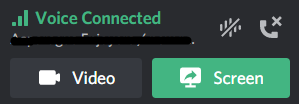
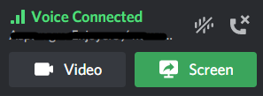

# discord-theme
Patch Discord's eye-straining theme back to the nice blurple and grey.

It currently changes
- Clyde svg is back to the normal clyde
- Horrible blue highlight color changed back to nice blurple like it was before
- Reactions have been squarified after being more circularized 
- Mentions have been reverted from the white background to the normal blue
- Button colors have been reverted
- Greens in the voice connection panel have been muted again
- Input Sensitivity Slider is back to normal muted green
- Add friend, add server, and find servers buttons are muted green

If you find anything that this misses, please open an issue describing what needs to be changed

### Comparisons Between Patched and New Discord
Patched: 
---

---
New Discord Theme:
---

# Using a custom CSS stylesheet
There are two methods to use a custom style sheet for Discord's theme: 
- Drag and drop the .css file onto the executable, it will automatically apply the stylesheet to Discord
- Pass a path to the .css file as an argument for the executable on the command line
#### BetterDiscord `.theme.css` files are not compatible with this program and may break your Discord (backups can still be restored if this happens)

# Using custom Javascript
This feature is largely expirimental but if you want to, edit the config.toml file that should be automatically created when running the executable and change the 
custom-js paramter to be whatever you want 

Note that the \` character should be escaped with a \\ in the javascript due to how insertion works

## Note on automatically downloading the latest theme from Github
If you decide that you don't want / trust the program downloading CSS from github and inserting it into your Discord whenever there is an update, compile using the command: 
> cargo build --release --no-default-features
> 
This will disable network connectivity, removing around 2MB from the finished binary size. It will also include the latest version of the theme availible when compiling and use this as the default theme
